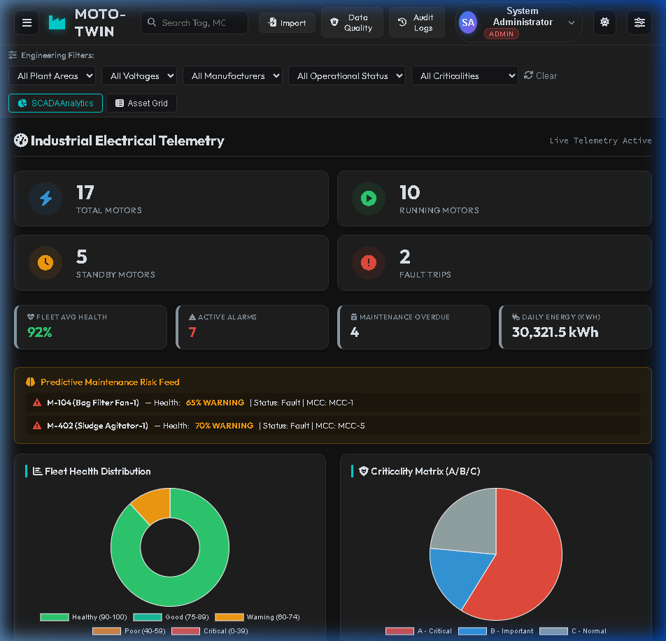
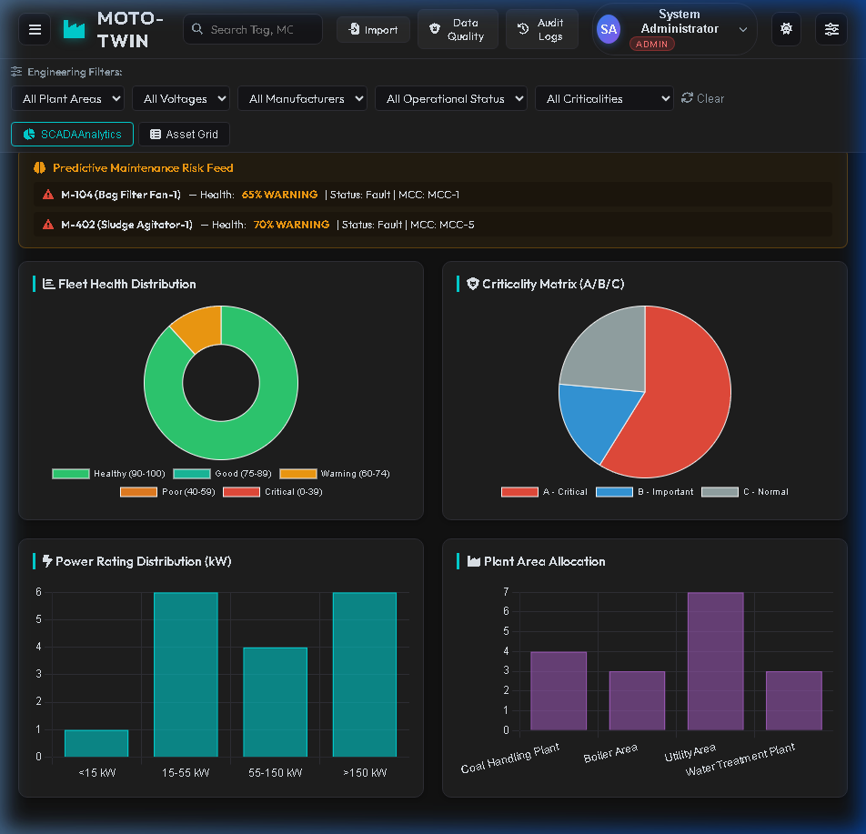
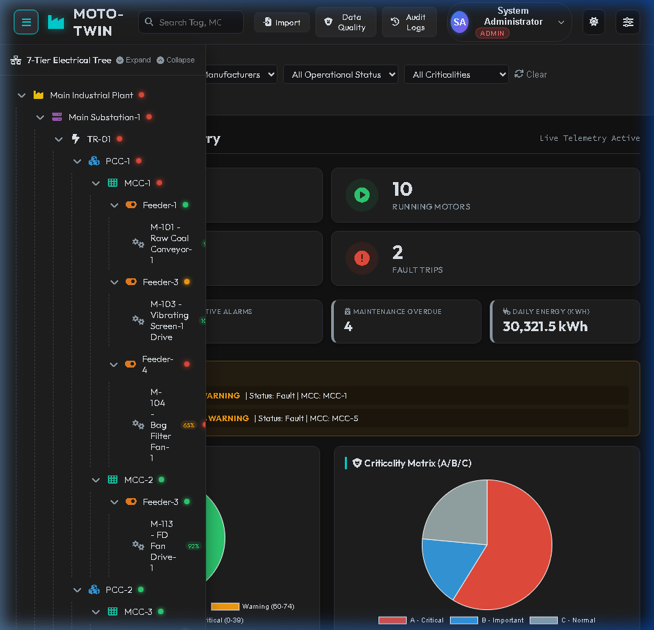
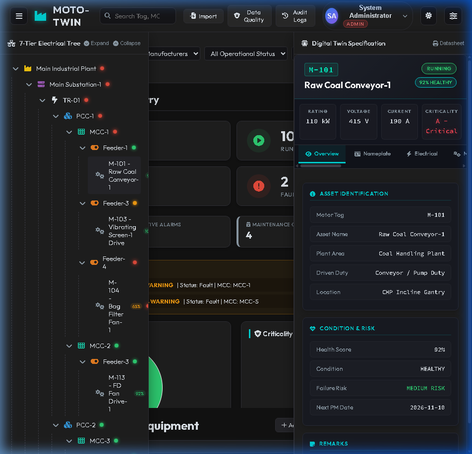
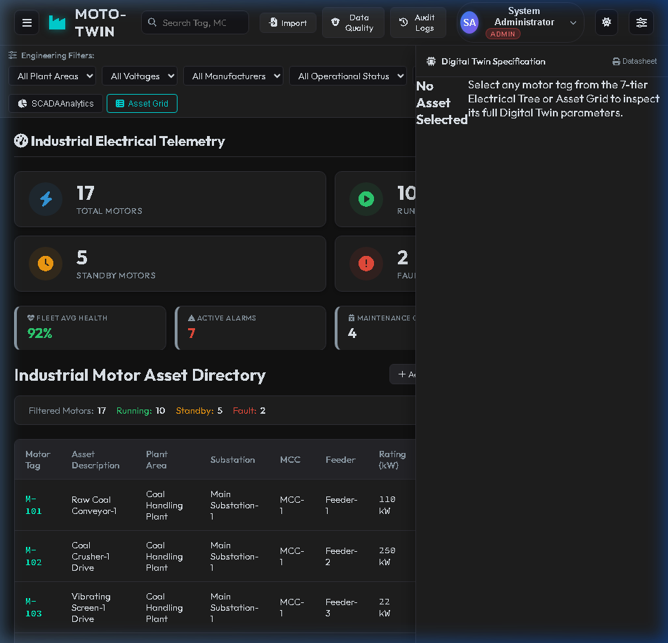

# MOTO-TWIN Dashboard UI Architecture & Visual Specification

## Executive Summary
This document provides a pixel-perfect visual and structural breakdown of the **MOTO-TWIN** index dashboard page. It is structured to enable another developer or AI coding agent to visually and programmatically recreate the entire front-end UI cleanly without needing backend database dependencies.

---

## 1. Overall Layout & Grid Architecture

The dashboard implements a multi-panel SCADA layout with interactive, collapsible side drawers:

```
+---------------------------------------------------------------------------------------------------+
| TOP NAVBAR (Fixed Header: Logo, Global Search Bar, Quick Audit Actions, User Profile, Settings)  |
+---------------------------------------------------------------------------------------------------+
| SUB-HEADER (Engineering Filters: Area, Voltage, Make, Status, Criticality | View Switcher)        |
+------------------------------------+--------------------------------+-----------------------------+
| LEFT DRAWER / SIDEBAR              | MAIN CONTENT AREA              | RIGHT DRAWER / SIDEBAR      |
| (7-Tier Electrical Tree Panel)     | (SCADA Analytics / Asset Grid) | (Digital Twin Specification)|
| Collapsible / Overlay              | Active View Window             | Collapsible / Overlay       |
| Width: ~320px                      | Flex-1 (Fluid Width)           | Width: ~380px               |
+------------------------------------+--------------------------------+-----------------------------+
```

### Layout Grid Specifications
* **Overall Container:** Flexbox / Grid layout filling 100vh height with body overflow hidden (`overflow: hidden`).
* **Top Header Height:** `60px` fixed height with dark translucent backdrop blur (`backdrop-filter: blur(10px)`).
* **Control Bar Height:** `~50px` height containing filter select dropdowns and view tab buttons.
* **Main Scrollable Window:** Height `calc(100vh - 110px)` with independent custom slim dark scrollbars (`scrollbar-width: thin`).
* **Side Drawers (Left & Right):** Absolute/Fixed floating drawer panels or flex sidebars with `z-index: 100`, dark border glow, and smooth CSS transform transitions (`transition: transform 0.3s ease-in-out`).

---

## 2. Color Palette & Typography

### Color System (SCADA Cyberpunk / Dark Mode Industrial)
* **Background Colors:**
  * Base Application Background: `#0a0e14` (Deep obsidian navy)
  * Card / Panel Surface Background: `#131920` (Dark slate gray)
  * Secondary Surface / Table Row Hover: `#1c2430` / `#222c3a`
  * Header & Control Bar: `#0f141c` with border `#263343`

* **Accent Colors:**
  * Primary Brand / Active Tab: Cyan `#00f5d4` / `#00b4d8` / `#00e5ff`
  * Secondary Accent: Electric Purple `#7209b7` / `#560bad`
  * Text Muted / Labels: `#8b949e` / `#6e7681`
  * Text Primary / Values: `#f0f6fc` (Clean off-white)

* **Status Colors:**
  * **Running / Healthy:** Emerald Green `#10b981` (Glow: `0 0 10px rgba(16,185,129,0.4)`)
  * **Standby / Warning:** Amber / Warm Orange `#f59e0b` (Glow: `0 0 10px rgba(245,158,11,0.4)`)
  * **Fault / Critical:** Crimson Red `#ef4444` / `#e63946` (Glow: `0 0 10px rgba(239,68,68,0.4)`)
  * **Normal / Info:** Steel Blue `#3b82f6`

### Typography & Icons
* **Font Family:** `'Inter'`, `'Segoe UI'`, sans-serif (Clean geometric sans-serif for UI labels and titles).
* **Monospace Font:** `'JetBrains Mono'`, `'Fira Code'`, monospace for Motor Tags (e.g., `M-101`) and numerical values.
* **Icon Set:** FontAwesome 6 Free Solid icons (`fa-bolt`, `fa-play`, `fa-clock`, `fa-exclamation-triangle`, `fa-sitemap`, `fa-sliders`, `fa-search`, `fa-file-excel`, `fa-shield-halved`, `fa-history`, `fa-cog`).

---

## 3. Component Details & UI Widgets

### 3.1 Top Navigation Bar (`.top-navbar`)
* **Left Section:**
  * Hamburger Toggle Button (`#mobile-tree-toggle`): Dark rounded button (`36x36px`) with `fa-bars` icon.
  * Brand Logo: Cyan double-layered cube icon (`fa-cubes` or SVG gradient logo).
  * Brand Title: `"MOTO-TWIN"` (Font size `18px`, weight `700`, letter spacing `1px`, white text with cyan accent).
* **Center Section:**
  * Global Search Box (`#global-search`): Pill-shaped input box, width `~300px`, dark background `#18202a`, placeholder `"Search Tag, MCC, Feeder, Voltage..."`, left-aligned magnifying glass icon (`fa-search`).
* **Right Section:**
  * Action Buttons:
    * `Import` (`#btn-import-excel`): Excel upload button with icon `fa-file-excel`.
    * `Data Quality` (`#btn-data-quality`): Audit tool with icon `fa-shield-halved`.
    * `Audit Logs` (`#btn-audit-logs`): History log button with icon `fa-history`.
  * User Profile Dropdown (`#user-avatar-btn`):
    * Avatar Circle: Blue gradient circle with initials `"SA"`.
    * Text Container: Name `"System Administrator"`, Role Badge `"ADMIN"` (Red pill badge `#ef4444`).
    * Dropdown Chevron (`fa-chevron-down`).
  * Control Buttons:
    * Theme Toggle (`#theme-toggle`): Settings gear icon (`fa-cog`).
    * Details Panel Toggle (`#mobile-details-toggle`): Sliders filter icon (`fa-sliders`).

---

### 3.2 Engineering Filters Bar & View Switcher
* **Filter Dropdowns:**
  * 5 Select Controls: `Plant Area`, `Voltage`, `Make`, `Operational Status`, `Criticality`.
  * Style: Dark slate select inputs (`#161c24`), subtle border `#2b3648`, white arrow icon.
  * Reset Button: `Clear` button (`#reset-filters`) with `fa-sync-alt` icon.
* **View Switcher (`.view-toggle-group`):**
  * Segmented Button Switcher:
    * `SCADA Analytics` (`#dashboard-toggle`): Active tab with cyan background/border gradient and icon `fa-chart-pie`.
    * `Asset Grid` (`#equipment-toggle`): Inactive tab with dark background and icon `fa-list`.

---

### 3.3 Main Dashboard View (`#dashboard-view`)

#### A. Telemetry Header Strip
* Title: `Industrial Electrical Telemetry` (Font size `20px`, bold).
* Live Status Pill: `"Live Telemetry Active"` with pulsing green radio dot.

#### B. Primary KPI Cards Grid (4 Top Cards)
Grid layout of 4 equal-width stat cards (or 2x2 grid on smaller screens):
1. **Total Motors:** Count `17`, Subtitle `TOTAL MOTORS`, Icon `fa-bolt` inside blue circular badge.
2. **Running Motors:** Count `10`, Subtitle `RUNNING MOTORS`, Icon `fa-play` inside green circular badge.
3. **Standby Motors:** Count `5`, Subtitle `STANDBY MOTORS`, Icon `fa-clock` inside amber circular badge.
4. **Fault Trips:** Count `2`, Subtitle `FAULT TRIPS`, Icon `fa-exclamation-triangle` inside red circular badge.

#### C. Secondary KPI Metrics Strip (4 Stat Boxes)
Horizontal 4-card container:
1. `FLEET AVG HEALTH`: `92%` (Large green metric font `24px`).
2. `ACTIVE ALARMS`: `7` (Large red metric font `24px`).
3. `MAINTENANCE OVERDUE`: `4` (Large white/amber metric font `24px`).
4. `DAILY ENERGY (KWH)`: `30,321.5 kWh` (Large white metric font `24px`).

#### D. Predictive Maintenance Risk Feed Banner
* Warning Alert Box with gold/amber border (`border: 1px solid #d97706`).
* Header: Icon `fa-brain` + Title `Predictive Maintenance Risk Feed` in gold font (`#fbbf24`).
* Feed Item 1: `M-104 (Bag Filter Fan-1) — Health: 65% WARNING | Status: Fault | MCC: MCC-1`
* Feed Item 2: `M-402 (Sludge Agitator-1) — Health: 70% WARNING | Status: Fault | MCC: MCC-5`

#### E. SCADA Analytics Charts Grid (2x2 Grid)
1. **Fleet Health Distribution (Doughnut Chart):**
   * Chart.js Doughnut Chart showing health tier breakdown:
     * Healthy (90-100): Emerald Green `#10b981`
     * Good (75-89): Teal `#14b8a6`
     * Warning (60-74): Amber `#f59e0b`
     * Poor (40-59): Dark Orange `#d97706`
     * Critical (0-39): Crimson `#ef4444`
   * Bottom legend with color blocks and percentage ranges.
2. **Criticality Matrix (Pie Chart):**
   * Segments:
     * A - Critical: Coral Red `#e63946`
     * B - Important: Cyan/Blue `#3182ce`
     * C - Normal: Slate Gray `#718096`
3. **Power Rating Distribution (Bar Chart):**
   * Categories: `<15 kW`, `15-55 kW`, `55-150 kW`, `>150 kW`.
   * Bar Style: Vertical cyan/teal filled bars (`#00a896`).
4. **Plant Area Allocation (Bar Chart):**
   * Categories: `Coal Handling Plant`, `Boiler Area`, `Utility Area`, `Water Treatment Plant`.
   * Bar Style: Vertical purple/violet filled bars (`#7209b7`).

---

### 3.4 Collapsible Left Panel: 7-Tier Electrical Tree (`#tree-sidebar`)
* **Header:** Title `7-Tier Electrical Tree` with action buttons `Expand` (`#tree-expand-all`) and `Collapse` (`#tree-collapse-all`).
* **Hierarchy Nodes (Nested Tree View):**
  1. `Main Industrial Plant` (Plant level node)
  2. `Main Substation-1` (Substation level node)
  3. `TR-01` (Transformer level node)
  4. `PCC-1` / `PCC-2` (Power Control Center node)
  5. `MCC-1` / `MCC-2` / `MCC-3` (Motor Control Center node)
  6. `Feeder-1` / `Feeder-3` / `Feeder-4` (Feeder node)
  7. `M-101 - Raw Coal Conveyor-1` (Motor Tag leaf node with health score badge `92%`).

---

### 3.5 Collapsible Right Panel: Digital Twin Specification (`#details-sidebar`)
* **Header:** Title `Digital Twin Specification` with `Datasheet` print button (`#print-motor-btn`).
* **Asset Summary Card (When Motor Selected, e.g., M-101):**
  * Tag Pill: `M-101` cyan outlined badge.
  * Status Badge: `RUNNING` green pill badge.
  * Health Badge: `92% HEALTHY` green badge.
  * Title: `Raw Coal Conveyor-1`.
* **Key Motor Parameters Grid (4 Cards):**
  * `RATING`: `110 kW`
  * `VOLTAGE`: `415 V`
  * `CURRENT`: `190 A`
  * `CRITICALITY`: `A - Critical` (Red highlighted text)
* **Tabbed Sub-Panels:**
  * Tabs: `Overview`, `Nameplate`, `Electrical`, `Mechanical`, `Telemetry`, `Alarms`.
  * **Overview Card Content:**
    * **ASSET IDENTIFICATION:** Motor Tag, Asset Name, Plant Area (`Coal Handling Plant`), Driven Duty (`Conveyor / Pump Duty`), Location (`CHP Incline Gantry`).
    * **CONDITION & RISK:** Health Score (`92%`), Condition (`HEALTHY`), Failure Risk (`MEDIUM RISK`), Next PM Date (`2026-11-10`).
    * **REMARKS:** System notes and comments.

---

### 3.6 Tabular Asset Grid View (`#equipment-view`)
* View Header: `Industrial Motor Asset Directory`.
* Quick Actions: `+ Add Motor Asset`, `Export Excel`, `Print Report`.
* Filter Summary Pill: `Filtered Motors: 17 | Running: 10 | Standby: 5 | Fault: 2`.
* Data Table Columns:
  `Motor Tag` | `Asset Description` | `Plant Area` | `Substation` | `MCC` | `Feeder` | `Rating (kW)` | `Voltage (V)` | `Health Score` | `Criticality` | `Status`

---

## 4. Captured Visual Screenshots

Here are the captured screenshots representing all major UI views:

1. **Dashboard Main View (Logged In SCADA Analytics):**
   

2. **Dashboard Lower Charts Grid View:**
   

3. **7-Tier Electrical Tree Left Sidebar View:**
   

4. **Digital Twin Specification Right Drawer View (Motor Selected):**
   

5. **Tabular Asset Directory Grid View:**
   

